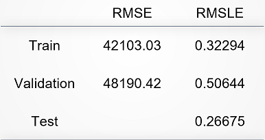

# < Title of your final project >

### Groups
* < 陳庭偉, 104304041 >
* < 陳柏勳, 107354001 >
* < 楊博安, 107354003 >
* < 林威均, 108354005 >
* < 周　平, 106356007 >

### Goal

To help the bank and house buyer evaluate the value of house, and make better investment, the goal of our project is to predict the house price through the attributes of house.

### Demo

You can pull the repository, and then run the command below to replicate our outcome:

```R
Rscript code/group_9.R --input data/data.rds --output results/performance.tsv
```
We also provide interative data visualization at shinyapp.io link below:

<a href = "https://pingchou.shinyapps.io/shiny/?fbclid=IwAR3Wi6-ZC2quD7R2bB7YCFNt86d1CN2pPJOdhkEFNL7eJw3pfR-XQD1AB8o">Click me to redirect to shinyapp.io</a>


## Folder organization and its related information

### docs

* Our project introduction document is placed at the path below
  * 'docs/1072_datascience_FP_nccu_stat_mis.pptx'
  * 'docs/1072_datascience_FP_nccu_stat_mis.pdf'

### data

* Source: Kaggle competition '<a href = "https://www.kaggle.com/c/house-prices-advanced-regression-techniques">House Prices: Advanced Regression Techniques'</a>
* Input format: The format and structure of the data is displayed below:


* Preprocessing: Due to large numbers of variable, please refer to the introduction document.
  * Missing value processing
  * Ordered value transformation
  * Confusing empty value transformation
  * Deleting nearly constant column

### code

* Null Model(baseline): Regression Tree with Pruning
* Our research model:
  1. Random Forest
  2. Extreme Gradient Boosting(xgboost)
  3. Support Vector Regression(SVR)
* Evaluation: Cross-validation with validation loss

### results

* Performance evaluation metric: RMSE and RMSLE
* Significance: 
  * Decision Tree(baseline)
  
  * Research Model1 - Random Forest
  
  * Research Model2 - Extreme Gradient Boosting(xgboost)
  
  * Research Model3 - Support Vector Regression(SVR)
  
* What is the challenge part of your project?

## Reference

* Code/implementation which you include/reference (__You should indicate in your presentation if you use code for others. Otherwise, cheating will result in 0 score for final project.__)
* Packages you use
* Related publications


