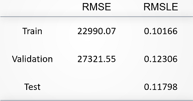

# < House Price Prediction by Machine Learning: Random Forest, XGBoost and SVR >

### Groups
* < 陳庭偉, 104304041 >
* < 陳柏勳, 107354001 >
* < 楊博安, 107354003 >
* < 林威均, 108354005 >
* < 周　平, 106356007 >

### Goal

To help the bank and house buyer evaluate the value of house, and make better investment, the goal of our project is to predict the house price through the attributes of house.

### Demo

You can pull the repository, and then run the command below to replicate our outcome:

```R
Rscript code/group_9.R --input data/data.rds --output results/performance.tsv
```
We also provide interative data visualization at shinyapp.io link below:

<a href = "https://pingchou.shinyapps.io/shiny/?fbclid=IwAR3Wi6-ZC2quD7R2bB7YCFNt86d1CN2pPJOdhkEFNL7eJw3pfR-XQD1AB8o">Click me to redirect to shinyapp.io</a>


## Folder organization and its related information

### docs

* Our project introduction document is placed at the path below
  * 'docs/1072_datascience_FP_nccu_stat_mis.pptx'
  * 'docs/1072_datascience_FP_nccu_stat_mis.pdf'

### data

* Source: Kaggle competition '<a href = "https://www.kaggle.com/c/house-prices-advanced-regression-techniques">House Prices: Advanced Regression Techniques'</a>
* Input format: The format and structure of the data is displayed below:


* Preprocessing: Due to large numbers of variable, please refer to the introduction document.
  * Missing value processing
  * Ordered value transformation
  * Confusing empty value transformation
  * Deleting nearly constant column

### code

* Null Model(baseline): Regression Tree with Pruning
* Our research model:
  1. Random Forest
  2. Extreme Gradient Boosting(xgboost)
  3. Support Vector Regression(SVR)
* Evaluation: Cross-validation with validation loss

### results

* Performance evaluation metric: RMSE and RMSLE
* Significance: 
  * Decision Tree(baseline)
  
  
  
  * Research Model1 - Random Forest
  
  
  
  * Research Model2 - Extreme Gradient Boosting(xgboost)
  
  
  
  * Research Model3 - Support Vector Regression(SVR)
  
  
  
* Challenge of our project:
  * Null model selection: complex regression predict fail due to drop unused column problem
  * Lack of domain know-how: unfamiliar with relationship between feature & target 

## Reference

* Website
  * https://cloud.tencent.com/developer/article/1005033
  * https://github.com/topepo/caret/issues/336
  * https://www.rdocumentation.org/packages/xgboost/versions/0.6.4.1/topics/xgb.importance
  * https://steve-chen.tw/?p=369
  * https://www.kaggle.com/c/house-prices-advanced-regression-techniques/overview
  * https://www.kaggle.com/erikbruin/house-prices-lasso-xgboost-and-a-detailed-eda
  * https://www.dehong.space/XGBoost
  * https://zhuanlan.zhihu.com/p/24577989
  * https://zhuanlan.zhihu.com/p/49049535
  * https://zhuanlan.zhihu.com/p/51586879
* Document
  * An Introduction to Statistical Learning, Gareth James Daniela Witten Trevor Hastie Robert Tibshirani
  * A tutorial on support vector regression, ALEX J. SMOLA and BERNHARD SCHOLKOPF, Statistics and Computing 14: 199–222, 2004
  * A support vector regression model for predicting tunnel boring machine penetration rates, Satar Mahdevari, Kourosh Shahriar, Saffet Yagiz and Mohsen Akbarpour Shirazi, International Journal of Rock Mechanics & Mining Sciences 72 (2014) 214–229
  * Support Vector Machine Regression, http://kernelsvm.tripod.com/,2019/06/24
* Online Course
  * 林軒田教授機器學習技法，https://www.csie.ntu.edu.tw/~htlin/mooc/
  


